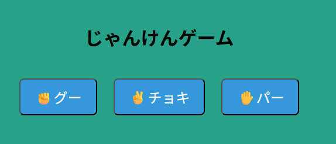

# Day05 - じゃんけんゲームアプリ



## 🖥 デモ

🔗 [Live Demo（GitHub Pages）](https://rrr-bit00.github.io/100-days-app-challenge/day05/)

---

## 📌 概要

1日1アプリ開発チャレンジ Day05 の作品です。
ボタンをクリックして「グー・チョキ・パー」のいずれかを出し、CPUとじゃんけんをして勝敗を判定します。
結果はモーダル風に画面上に表示され、CSSでの演出や状態切り替えに挑戦しました。

---

## 🚀 機能一覧

- 「グー」「チョキ」「パー」ボタンによる手の選択
- Math.random による CPU の手のランダム選出
- プレイヤーとCPUの手を比較し、勝敗判定を実行
- 結果は画面全体にモーダル風で表示される
- 結果表示はクリックで非表示に戻せる
- CSSでボタンサイズ・レイアウト・色などを調整

---

## 🛠 使用技術

- HTML（ボタンUIと結果表示）
- CSS（スタイル調整・モーダル演出・Flexbox）
- JavaScript（イベント処理・勝敗ロジック・DOM操作）

---

## 📂 ファイル構成

```
day05/
├── index.html
├── style.css
├── main.js
└── README.md
```

---

## ✅ 今後の改善案

- 勝敗によって背景色を変える（勝ち＝緑、負け＝赤、あいこ＝グレー）
- 履歴表示機能（直近の勝敗をリストで残す）
- アニメーション演出（フェードイン／スライド）
- CPUの手を画像で表示する
- 一定時間で自動的にモーダルを閉じる

---

## 💡 学び・工夫した点

- `Math.random()` と `Math.floor()` を使ってランダムな手を出す処理を実装
- `if` / `else` による勝敗判定ロジックの組み立て
- `querySelectorAll` と `forEach` で複数ボタンにイベントをバインド
- `dataset` 属性で選択値を柔軟に扱う設計
- `textContent` を使って勝敗結果を表示
- CSS `position: fixed` と `z-index` を活用したモーダル表現
- クラスの切り替え（`.classList.add/remove`）で状態を制御
